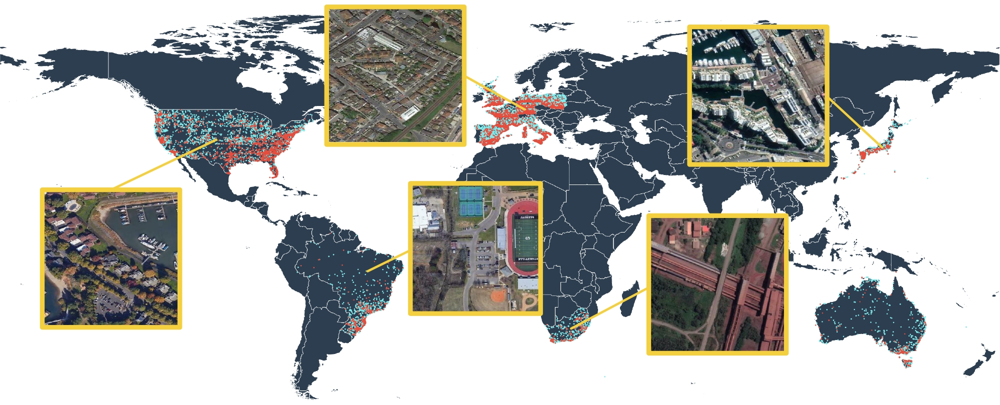
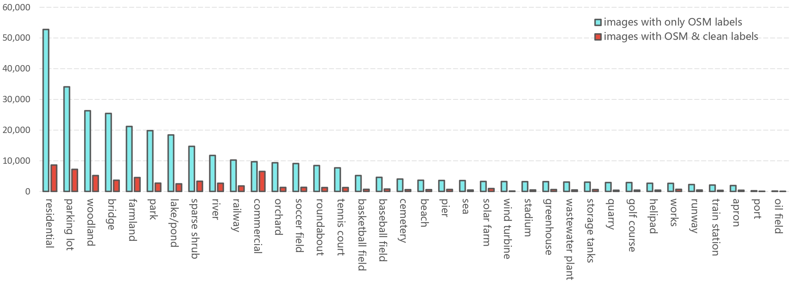

# Multi-Scene-Recognition
Multi-scene recognition is a challenging task due to that

+ images are large-scale and unconstrained
+ all present scenes in an aerial image need to be exhaustively recognized

In this work, we propose a large-scale dataset, namely MultiScene dataset, and provide extensive benchmarks.

## MultiScene Dataset
MultiScene dataset aims at two tasks: 1) *developing algorithms for multi-scene recognition* and 2) *network learning with noisy labels*.

We collect 100k high-resolution aerial images with the size of 512x512 around the world. All of them are assigned with crowdsourced labels provided by [OpenStreetMap (OSM)](https://www.openstreetmap.org/), and 14k of them are mannually inspected yielding clean labels (show in red). 

In total, 36 scene categories are defined in our dataset, and 22 models are tested. 

